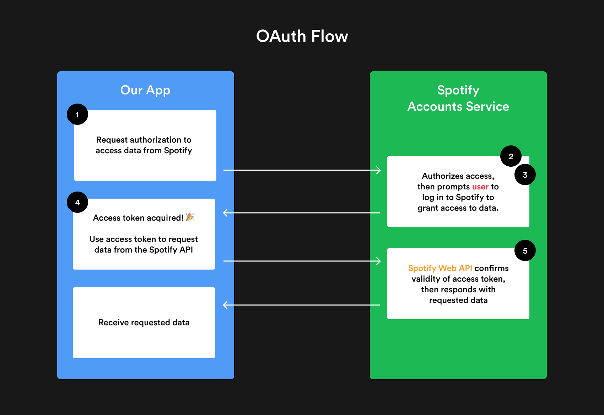
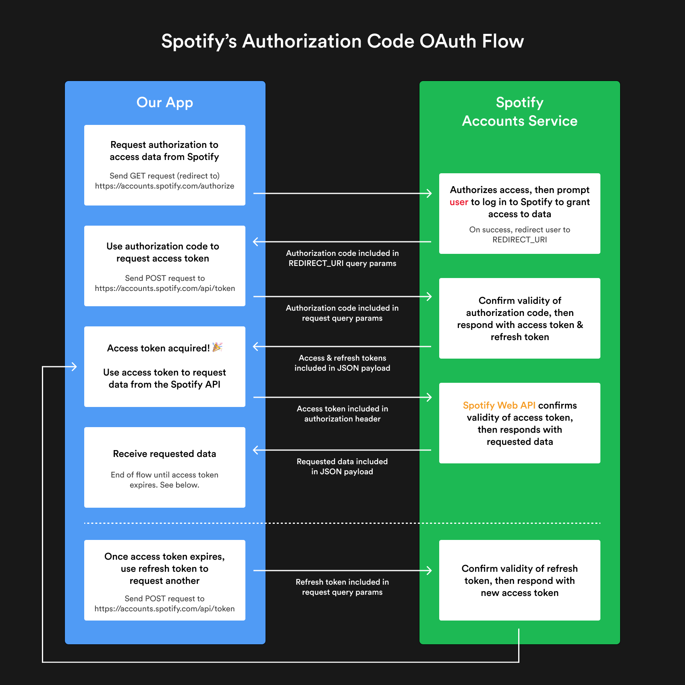

# Spotify Web App

A web app to visualize personalized Spotify data including features that aren't readily available in the official Spotify app. 

# Front end

- React (with hooks)
- Styled Components
- React Router

# Back end

- Node
- Express
- Heroku

# REST APIs and Express

- difference between regular APIs and REST APIs
- basic REST principles
- anatomy of REST API requests and responses
- how Express fits in with Node.js
- how to create a Node server with Express
- how to handle HTTP requests and responses with Express route handlers

# Nodemon

Nodemon is a tool that automatically restarts our Node server when any changes in index.js are detected, saving us the hassle of stopping and restarting the server any time we want our changes to be reflected. 
To install nodemon as a development dependency, run: \
`npm install --save-dev nodemon`\
I've also added an npm script in `package.json` to run `nodemon` on our Node server when we run `npm start`.

# API - Application Programming Interface

Think of this as a set of rules that allow one piece of software to talk to another. APIs make our lives easier by abstracting away complex code and replacing it with simpler more straight-forward code. 
Imagine what happens when you open the Spotify app and play a song. There's probably some code that runs on clicking Play that looks like this:\
`mediaPlayer.play();`\
The play() function is an API method that abstracts away things like:
- The code needed to retrieve the audio file from the internet or your device
- The code needed to send audio data to your device

In client-side JS, APIs are usually based on **objects**. Chances are you've seen the following: \
`const element = document.querySelector('.special-class');`\
This is an example of using the DOM (Document Object Model) API. The `document` object is being used as the entry point for the DOM API, and `querySelector()` is the API method. 
Note: these APIs aren't part of the JS language, but they are **built on top of JS** to give developers a convenient set of tools out of the box. 

## Types of APIs

In the web development world, APIs generally falls into one of two categories: **browser APIs** and **third-party APIs**.

### Browser APIs

These APIs are built into your web browser (like Chrome or Safari) and expose data from the browser and surrounding computer environment that developers can easily leverage. The most common browser API is 
the **DOM API**. It lets you manipulate HTML and CSS -- creating, removing, and changing HTML, dynamically applying new styles to your page, etc. There's a long list of browser APIs, another notable one is 
the Web Audio API that let's you manipulate audio in the browser. It allows you to do some very interesting things like altering the volume of a track, apply different effects to it, etc. The API abstracts 
away all the complex lower-level code that's doing the actual audio processing so you can focus on building something cool. 

### Third-party APIs

Third-party APIs are not built into the browser by default, and you generally have to retrieve their code and information from somewhere on the web. For instance, the Twitter API allows you to do things like 
displaying your tweets on your website. Similarly, the Spotify API allows us to do things like displaying your top artists and tracks of all time. More details to follow. 

## REST APIs

When people talk about third-party APIs like the Spotify API or the GitHub API, they're talking about a REST API. REST stands for **Representation State Transfer**. 
If an API is a set of rules that allow one piece of software to talk to another, then REST is a standard set of rules that developers follow to create an API. These rules determine *what the API looks like*.
For an API to be considered RESTful, certain criteria must be met: 
- **Client-Server**: The API should enable a client-server architecture made up of clients, servers, and resources, with requests managed through HTTPd. When System A makes an HTTP request to a URL hosted by 
System B, System B's server should return a response. 
- **Stateless**: All requests should be independent of each other. It should be possible to make two or more HTTP requests in any order, with the same responses being received. 
- **Cacheable**: The API should make data cacheable, to streamline client-server interactions. 
- **Uniform Interface**: There should be a uniform interface between components so that information is transferred in a standard form.
- **Layered**: The requesting client doesn't need to know whether it's communicating with the actual server, a proxy, or any other intermediary.
- **Code-on-demand**: The API allows executable code to be sent from the server to the client when requested, extending client functionality. 

### RESTful Requests

In simple terms, the client-server side of RESTful APIs means that you should be able to receive a piece of data (also known as a resource) when you access a predefined URL. 
Each of these URLs, also known as "endpoints", are part of what is called a **request**, and the data you receive from the request is called a response. The resources provided by these responses are usually in 
the form of JavaScript Object Notation (JSON). 
A RESTful request is composed of four parts:
1. the endpoint URL
2. the HTTP method
3. the HTTP headers
4. the body data

#### 1. The endpoint

The "endpoint" is the URL you request. All REST APIs have a base URL (also known as the "root" endpoint). For example, the base URL of Spotify's API is `https://api.spotify.com` while the base URL of GitHub's API is 
`https://api.github.com`. Additionally, each endpoint in a REST API has a **path** that determines the resource being requested. Some endpoints also support **query parameters**, which give you the option to modify 
your request with key-value pairs. They always come after the main URL you're requesting and begin with a question mark (`?`). Each key-value pair is specified with an equal sign (`=`) and each parameter pair is 
separated with an ampersand (`&`), like this:\
`https://some-api.com?query1=value1&query2=value2`\
Query parameter values cacn sometimes be a list of things. In these cases, it's common to use comma-separated lists. The playlist endpoint example above supports query parameters. Here's an example with the `fields` 
query parameter:\
`https://api.spotify.com/v1/playlists/{playlist_id}?fields=description,uri`\
This endpoint will return just the playlist's description and URI and exclude any other data it would usually return. 
Spofity API Documentation [here](https://developer.spotify.com/documentation/web-api/reference/#/)\
Endpoints are just like any other URL you visit on the web, but instead of returning data for a website, they return resources (e.g. data like JSON or XML). 

#### 2. The HTTP method

The second part of a RESTful request is the HTTP method. This method is the **type of request** you send to the server. There are five common types: `GET`, `POST`, `PUT`, `PATCH`, and `DELETE`. They are used to 
perform four possible operations: Create, Read, Update, and Delete (**CRUD**).
- **GET**: Retrieves or "reads" resources
- **POST**: Creates resources
- **PUT / PATCH**: Updates resources
- **DELETE**: Deletes resources

When working with a REST API, the documentation should tell you which HTTP method to use with each request. For example. Spotify's get playlist endpoint from the examples above should be used with a `GET` request.\
`GET https://api.spotify.com/v1/playlists/{playlist_id}`\
The resource this endpoint returns is some JSON about a specific playlist. 

#### 3. The HTTP headers

HTTP request headers are used to provide information to both the client and server. You can store things like authentication tokens, cookies, or other metadata in HTTP headers. In our app, we'll be sending 
basic authorization headers in our HTTP requests so the Spotify API can authorize our requests. 
Headers are **key-value** pairs that are separated by a colon. The example below shows a header that tells the server to expect JSON content.
`"Content-Type: application/json"`\
A complete list of valid headers [here](https://developer.mozilla.org/en-US/docs/Web/HTTP/Headers)

#### 4. The body data

Finally, the "body" of a request contains any information you want to send to the server. Since `GET` requests don't need any extra information from you to return existing resources, only `POST`, `PUT`, `PATCH`, or 
`DELETE` requests can have body data. 
The body data you send along with these requests is usually the data you'd like to create a new resource with (via a `POST` request) or the modified value of a resource you'd like to update (`PUT` or `PATCH`).
Data is normally transmitted in the HTTP request's body by sending a single JSON-encoded data string. 

### RESTful Responses

REST API responses usually return resources (data) in the form of JSON. 
Here's an example of the JSON response returned from the Spotify API's `playlist` endpoint:
```json
// GET https://api.spotify.com/v1/playlists/59ZbFPES4DQwEjBpWHzrtC
{
    "collaborative": false,
    "description": "Having friends over for dinner? Here´s the perfect playlist.",
    "external_urls": {
        "spotify": "http://open.spotify.com/user/spotify/playlist/59ZbFPES4DQwEjBpWHzrtC"
    },
    "followers": {
        "href": null,
        "total": 143350
    },
    "href": "https://api.spotify.com/v1/users/spotify/playlists/59ZbFPES4DQwEjBpWHzrtC",
    "id": "59ZbFPES4DQwEjBpWHzrtC",
    "images": [
        {
            "url": "https://i.scdn.co/image/68b6a65573a55095e9c0c0c33a274b18e0422736"
        }
    ],
    "name": "Dinner with Friends",
    "owner": {
        "external_urls": {
            "spotify": "http://open.spotify.com/user/spotify"
        },
        "href": "https://api.spotify.com/v1/users/spotify",
        "id": "spotify",
        "type": "user",
        "uri": "spotify:user:spotify"
    },
    "public": null,
    "snapshot_id": "bNLWdmhh+HDsbHzhckXeDC0uyKyg4FjPI/KEsKjAE526usnz2LxwgyBoMShVL+z+",
    "tracks": {
        // Removed for brevity
    },
    "type": "playlist",
    "uri": "spotify:user:spotify:playlist:59ZbFPES4DQwEjBpWHzrtC"
}
```
There's a lot of useful information stored in this JSON that we can use on the front end, like the playlist name, description, cover image, and number of followers. 

### HTTP status codes

Another REST principle is that every REST API response should also include an HTTP status code in the response header. These status codes are numbers that indicate whether a request was successfully 
completed, and range from the 100s to the 500s. In general, the categories are:
- 100+: Informational response
- 200+: Request has succeeded
- 300+: Request has redirected to another URL
- 400+: An error that originates from the client has occurred
- 500+: An error that originates from the server has occurred

# Express

Express is a popular framework for Node.js, designed for building web applications. At its core, it provides HTTP utility methods and middleware for developers to easily create powerful APIs. Express 
makes it easy to do things like: 
- Write handlers for requests with different HTTP verbes (GET, POST, DELETE, etc.) at different URL paths (routes)
- Integrate with "view" rendering engines (Pug, Mustache, EJS, etc.) to dynamically generate responses
- Add additional request processing middleware at any point within the request handling pipeline to handle things like authentication, cookies, URL parameters, and more

Express documentation [here](https://expressjs.com/en/starter/basic-routing.html)


## Routing

When a user goes to a URL (i.e. makes a request to an endpoint), we need to define what happens behind the scenes when the user hits that endpoint, as well as what they get back as a response. 
For example, when a user hits an endpoint we might want to query a database for information, modify data in some way, or create a new instance of something (like posting a new picture on Instagram). 
Think CRUD operations! 

## Route handlers

With Express apps, every route definition is structured like this:
`app.METHOD(PATH, HANDLER)`
- `app` is an Express instance
- `METHOD` is an HTTP request method in lowercase (like get or post)
- `PATH` is a URL path on the server
- `HANDLER` is the callback function that is run every time a user hits the specific URL

The callback function takes a request and a response object as arguments. No matter what you call the arguments, the first argument will always be the request and the second will always be the response. 

## Responses

There are a bunch of response methods for ending the request/response cycle such as `res.send()`, `res.json()` to send a JSON response or `res.sendFile()` to send a file. `res.json()` is probably the response method 
most often used. Here is an example: \
```js
app.get('/', (req, res) => {
    const data = {
        name: 'Brittany', 
        isAwesome: true
    };

    res.json(data);
});
```

## Requests

The callback function's request (req) argument is an object. This object contains information about what's coming in with the request. Here are a few examples:
- req.body: Contains key-value pairs of data submitted in the request body
- req.method: Contains a string corresponding to the HTTP method of the request
- req.params: An object containing properties mapped to the named route "parameters"
- req.query: An object containing a property for each query string parameter in the route

req.query is a property that's commonly utilized in route handlers. A simple example would be using the endpoint's query parameters (the key value pairs following the `?` in the URL) to dynamically generate a 
response. If you add the handler above for the `/awesome-generator` endpoint to your `index.js` file and restart the server, you should be able to dynamically change the text that is being displayed in your browser 
by updating the URL's query parameters in your browser's address bar. In our route handler, we use destructuring to grab the `name` and `isAwesome` properties off the req.query object. Then we dynamically generate 
the string to send back with template strings. If `isAwesome` is true, the string will end with "really awesome", and if its false, it'll end with "not awesome". \
`res.send(``${name} is ${JSON.parse(isAwesome) ? 'really' : 'not'} awesome``);`

# OAuth

OAuth (Open Authorization) is a secure, industry-standard protocol that allows you to approve one application interacting with another on your behalf **without giving away your password**. Instead of passing user 
credentials from app to app, OAuth lets you pass authorization between apps over HTTPS with **access tokens**. For example, you can tell Facebook it's okay for Spotify to access your profile or post updates to your 
timeline without having to give Spotify your Facebook password; in the event Spotify suffers a breach, your Facebook password remains safe. \
In our case, when a user authorizes our app to access their Spotify account data, we won't be storing their username or password anywhere. We don't want to be responsible for sensitive information like this, so 
instead, we'll rely on the OAuth protocol to take care of authorization flow with access tokens. 

## Authorization, not Authentication

It's important to remember that OAuth is about **authorization**, not authentication. **Authorization** is asking for permission to do things. **Authentication** is about proving you are the correct person by 
providing credentials like a username or password. OAuth scenarios almost always represent two unrelated sites or services trying to accomplish something on behalf of users or their software; all three must work 
together, with multiple approvals, for the completed transaction to get **authorized**. 

## Roles

You can picture OAuth as a series of handshakes. If all handshakes are completed, then your reward is a unique access token that only your app can use to access resources from a service. There are four main 
**roles** that need to "shake hands" to get that token. 
- **Resource Server**: The API which stores data the application wants to access (*Spotify API*)
- **Resource Owner**: Owns the data in the resource server (*the users who wants to log into our app with Spotify is the owner of their Spotify account*)
- **Client**: the application that wants to access your data (*our app*)
- **Authorization Server**: The server that receives requests from the client for access tokens and issues them upon successful authentication and consent by the resource owner (*Spotify Accounts Service*)

## Scopes

Scopes are used to specify exactly which resources should be available to the client that is asking for authorization. They provide users of third-party apps with the confidence that only the information they 
choose to share will be shared, and nothing more. The resource server (in our case, the Spotify API) is in charge of defining these scope values, and which resources they relate to. The Spotify API has many scopes 
for different purposes. For example, the `user-read-private` scope is for read access to a user's subscription details and is required if you want to access the `https://api.spotify.com/v1/me` endpoint to get 
currently logged-in user's profile information. There is also a scope `playlist-modify-private` that is required if you need write access to a user's private playlists. this scope allows you to do things like 
add items to a playlist or upload a custom playlist cover image.\
All available scopes for the Spotify API [here](https://developer.spotify.com/documentation/general/guides/scopes/)

## Tokens

As mentioned before, all the back and forth hand-shaking OAuth requires is to get **an access token**. Our app needs this token to successfully access resources on the Spotify API. With every API request 
we make, we'll include our token in the HTTP request headers. If we don't, the Spotify API won't know our app has been authorized by the user, and will reject our requests for any data. \
You can think of access tokens like two-factor authentication codes that some services send via text message for you to log in. Just like 2FA auth codes, OAuth codes have a limited time they are valid for. 
After a while, all tokens expire, and you'll need to request another one (or refresh it) for security purposes. 

## OAuth flow
1. Client requests authorization to access data from Spotify
2. Spotify authorizes access to client
3. User grants app access their Spotify data
4. Client receives access token from Spotify
5. Client uses access token to request data from Spotify 

Before any client or server requests are made, the **client ID** and the **client secret** are used to identify and authenticate your specific app when requesting an access token. First, the client (our app) 
sends an authorization request containing the client ID and secret to the authorization server (the Spotify Accounts Service). This request also includes any scopes the client needs and a redirect URI 
which the authorization server should send the access token to. Second, the authorization server (Spotify) authenticates the client (our app) using the client ID and secret, then verifies that the requested 
scopes are permitted. Then, the user is redirected to a page on the Spotify authorization server where they can grant the app access to their Spotify account. In our case, the user will have been sent a page 
that belongs to the Spotify accounts service (note the `accounts.spotify.com` URL), where they can log into Spotify. Once the user grants access by logging into Spotify, the authorization server redirects the 
user back to the client (our app) with an access token. Sometimes, a refresh token is also returned with the access token. Finally, the client can use the access token to access resources from the resource 
server (Spotify API). 



## Spotify Authorization Flow

[Spotify Authorization Code](https://developer.spotify.com/documentation/general/guides/authorization-guide/#authorization-flows)

There are four possible ways for obtaining app authorization: 
1. Authorization Code Flow
2. Authorization Code Flow with Proof Key for Code Exchange (PKCE)
3. Implicit Grant Flow
4. Client Credentials Flow

Each flow provides a slightly different level of authorization. For example, the Implicit Grant Flow can be implemented entirely client-side (no server), but does not provide a refresh token. The Client Credentials 
Flow is used for server-to-server authentication, but authorization does not grant permission to access user resources. Out of the four flows, the **Authorization Code Flow** is the only one that lets the client 
access user resources, requires a server-side secret key (an extra layer of security), and provides an access token that can be refreshed. The ability to refresh an access token is a big advantage -- users of our 
app will only need to grant permission once. 




## Axios

Although it is possible to send a `POST` request using Node's built-in modules, it can get pretty verbose and clunky. A popular abstraction we can use instead is the Axios library, which provides a simpler API. Axios 
also works both client-side (in the browser) and server-side (in our Express app). \
To install `axios` as a dependency: \
`npm install axios` \
and import at top of our index.js file: `const axios = require('axios');`

## React Front end

We will set up a React app for the front end of our app; we'll configure our project to handle two `package.json` files and update our workflow to run both client-side and server-side code at the same time. We will 
pass the OAuth access token from our Node server to our React app, and we will run an Express app and a React app concurrently. 

## Proxying API requests

We want to make an HTTP request from our React app to one of our Express app's endpoints, such as when our access token expires, and we need to get a new one with the `/refresh_token` endpoint we set up. 
If we tried to send a GET request to `http://localhost:8888/refresh_token` from `http://localhost:3000`, we would run into a CORS (Cross-Origin Resource Sharing) issue. This is usually caused when 
you are trying to access resources from another domain, and the domain you're requesting resources from is not permitted. 
To tell the development server to proxy any unknown requests to our API server in development, we set up a proxy in our React app's `package.json` file for `http://localhost:8888` where our Express app runs. This allows 
us to set up a request to our Express app's `/refresh_token` endpoint (without `http://localhost:8888`) using `fetch()` in our `App.js`. 

## Running two servers at the same time
To improve the development workflow, we added an npm package called Concurrently to the root of our project that allows us to run multiple npm commands at the same time. We have also set up a command for `npm install` that installs all `node_modules` required to run both apps. 
Instead of manually running `npm install` twice when setting up the project, we added a postinstall script to our root package.json to automatically run `npm install` in the `client` directory after installation has finished 
in the root directory. 

## Project Structure

.
├── client
│   ├── node_modules
│   ├── public
│   ├── src
│   ├── .gitignore
│   ├── package-lock.json
│   ├── package.json
│   └── README.md
├── node_modules
├── .env
├── .gitignore
├── .nvmrc
├── index.js
├── package-lock.json
└── package.json

## Local Storage

- Upon first visit, log in, then store token from query params in local storage
- Store timestamp in local storage
- With next API call, first check for stored tokens
- Use stored timestamp to make sure tokens are not expired
    - if valid, use that in our API request
    - if expired, use refresh token to hit /refresh_token
        - store new tokens in local storage and update timestamp

Four items in local storage
1. Spotify access token
2. Spotify refresh token
3. Spotify access token expire time (3600 seconds)
4. Timestamp of when the access token currently in use was fetched and stored

## React Routing
We plan to have the following pages: 
- Profile page (`/`)
- Top Artists page (`/top-artists`)
- Top Tracks page (`/top-tracks`)
- Playlists page (`/playlists`)
- Playlist details page (`/playlists/:id`)

We will use React Router to set up routing for these pages by importing `react-router-dom` version 5.2.0. 

# Contributors

- Source: https://newline.co/courses/build-a-spotify-connected-app by Brittany Chiang
- [**Alexander Sung**](https://github.com/alsung) - Creator 